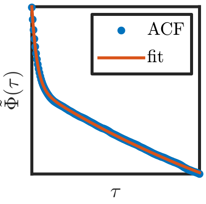

# Acquiring blinking and bleaching rates using autocorrelations

## Motivation

The aim of this project was to quickly acquire photoblinking/photobleaching rates of immobile fluorescent dyes using an ensemble autocorrelation method. To summarize the main advantages: 

  * Rapid way to determine characteristic photoblinking/photobleaching times
  * Able to analyze high-density systems
  * Able to analyze rates faster than the detector
  
## Features

  * Simulator
  * Autocorrelation code
  * Fitting functions
  

 
 &nbsp;
 
 &nbsp;
 
   
 <i> Sample simulation clip and autocorrelation output </i>
   
 
   
 <i> Fit and simulated parameters for simulation shown above</i>

## Usage

Please see the [demo](demo) folder for an example of how to use the code in this repository.
